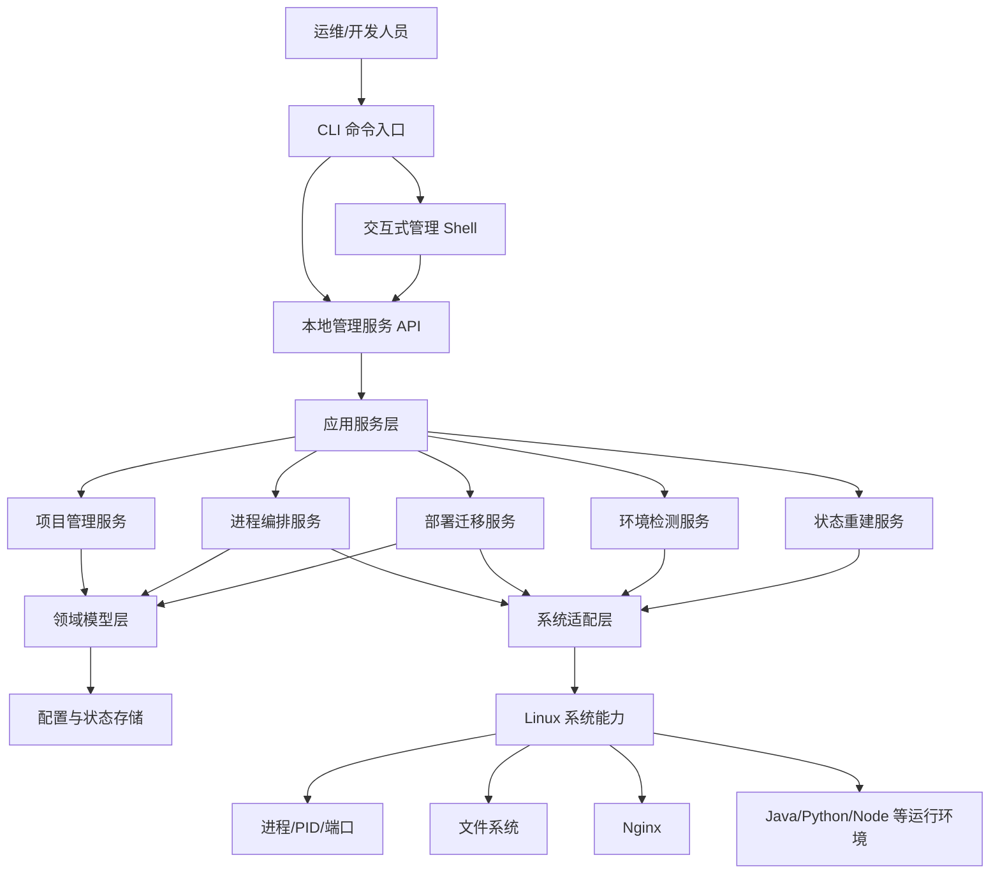
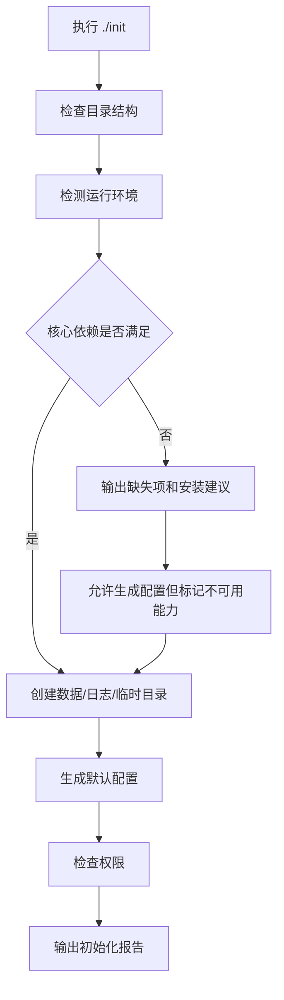
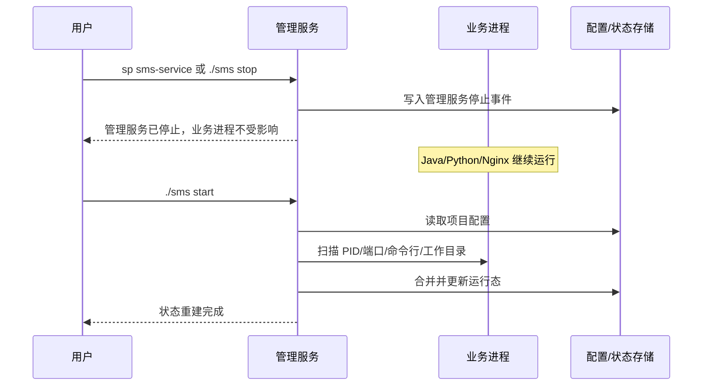
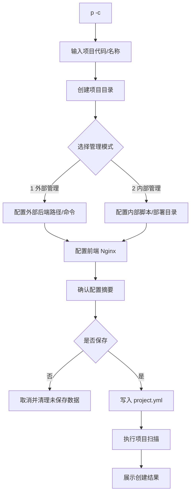
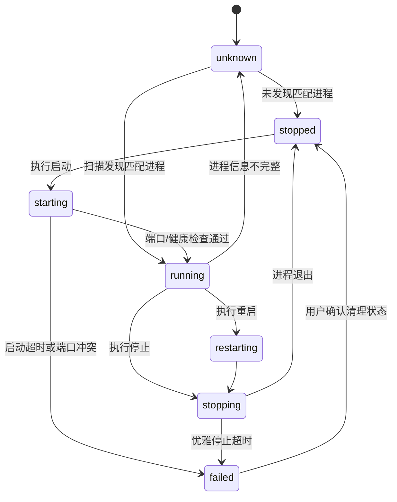
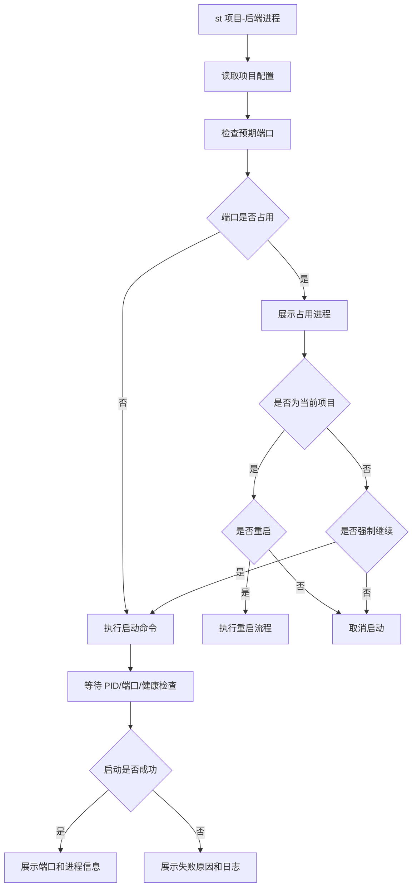
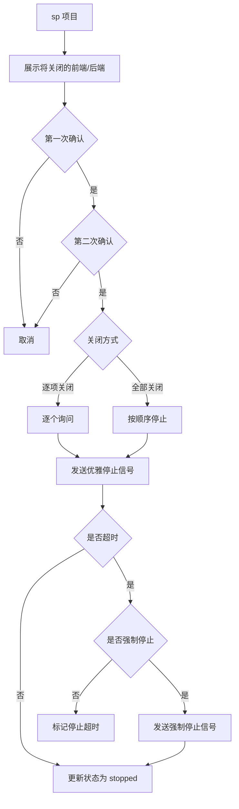
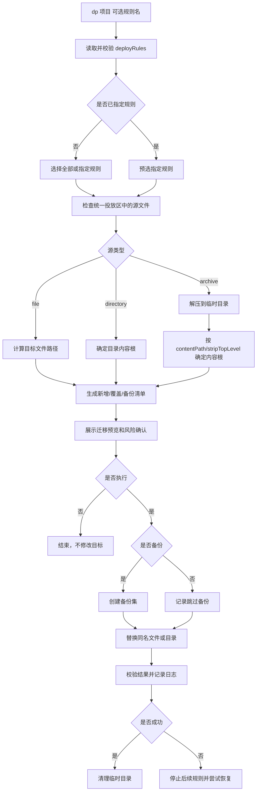
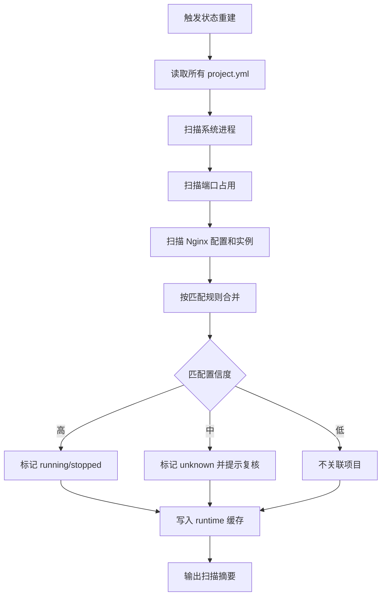

# 服务管理系统产品文档（Linux 版）

## 1. 产品定位

服务管理系统 Linux 版是一个轻量级项目与进程管理工具，用于在服务器上统一完成环境检测、项目配置、进程启停、前端 Nginx 部署、部署文件迁移、状态重建与运行审计。

它不是容器平台，也不是完整的 CI/CD 平台。产品边界应保持清晰：重点解决“小体量、多项目、多进程、可恢复、易操作”的本地部署管理问题。

## 2. 设计目标

1. 架构条理清晰：核心能力拆分为 CLI、应用服务、领域模型、系统适配、持久化与运行探测。
2. 目录职责明确：安装目录、配置目录、项目目录、部署文件目录、备份目录、日志目录独立。
3. 代码逻辑分层清晰：命令解析不直接操作系统进程；所有进程操作通过统一服务编排。
4. 资源占用小：默认不做高频轮询，不引入重型数据库，运行态数据可重建。
5. 服务与托管进程解耦：管理服务停止时，不影响已经启动的 Java、Python、Node、Nginx 等进程。
6. 可恢复：管理服务重启后，根据项目配置、端口占用、进程命令行、PID、工作目录等信息重新收集并更新管理状态。

## 3. 核心概念

| 概念 | 说明 |
| --- | --- |
| 管理服务 | 服务管理系统自身的后台进程，负责命令接收、状态维护、日志记录和系统探测。 |
| 交互会话 | 用户通过 `enter` 进入的命令行管理环境。 |
| 项目 | 一组后端进程、前端 Nginx 配置和部署文件规则的集合。 |
| 后端进程 | Java、Python、Node、Go、Shell 等可通过命令启动的服务进程。 |
| 前端进程 | 以 Nginx 为核心的前端站点、Nginx 实例或 Nginx server 配置。 |
| 外部管理 | 项目代码、脚本、Nginx 根目录已经存在，系统只记录路径并管理启停。 |
| 内部管理 | 系统在项目专属目录中管理部署物、配置、脚本、备份和运行状态。 |
| 运行态 | 当前检测到的进程、端口、PID、启动时间、状态等临时数据。运行态不是事实来源，可重建。 |

## 4. 总体架构



## 5. 分层职责

| 层级 | 主要职责 | 不应承担的职责 |
| --- | --- | --- |
| CLI 层 | 参数解析、交互提示、结果展示、二次确认。 | 不直接 kill 进程，不直接改项目配置。 |
| 应用服务层 | 编排项目、进程、迁移、恢复流程。 | 不依赖具体 Linux 命令细节。 |
| 领域模型层 | 定义项目、进程、部署规则、状态枚举和校验规则。 | 不访问文件系统和系统命令。 |
| 系统适配层 | 封装 `ps`、`ss`、`lsof`、`nginx`、信号、文件复制、压缩与解压等系统调用。 | 不决定业务流程。 |
| 存储层 | 保存项目配置、运行态缓存、操作日志、备份索引。 | 不做业务判断。 |
| 恢复层 | 根据配置和系统现状重建状态。 | 不主动启动或关闭业务进程。 |

## 6. 推荐目录结构

安装包解压后的根目录：

```text
service-management-system/
  init                         # 初始化入口
  sms                          # 主命令入口
  bin/                         # 可执行文件和内部脚本
  conf/                        # 全局配置
    app.yml
    logging.yml
  projects/                    # 项目配置与项目专属资产
  data/
    runtime/                   # 运行态缓存，可重建
    backups/                   # 全局备份索引与共享备份
    logs/                      # 系统日志、操作日志
  templates/                   # 项目模板、进程模板、nginx 模板
  tmp/                         # 临时文件
  docs/                        # 产品文档和使用说明
```

单个项目目录：

```text
projects/<project_code>/
  project.yml                  # 项目主配置，事实来源
  deploy-files/                # 统一部署文件投放区，不按前端/后端/配置分类
  backups/                     # 项目级备份
    files/
    dirs/
  logs/                        # 项目操作日志
  scripts/                     # 内部管理项目可放启动/停止脚本
  runtime.json                 # 项目运行态缓存，可重建
```

## 7. 数据设计

### 7.1 项目配置

`project.yml` 是项目事实来源。运行状态不得只依赖该文件，必须结合系统探测结果。

```yaml
code: demo
name: 示例项目
manageMode: external # external | internal
description: ""

backends:
  - name: api
    runtime: java
    workDir: /opt/demo/backend
    startCommand: "nohup java -jar demo-api.jar --server.port=8080 > logs/api.out 2>&1 &"
    stopMode: graceful
    expectedPorts: [8080]
    healthCheck: "http://127.0.0.1:8080/actuator/health"
    match:
      commandContains: "demo-api.jar"
      cwd: /opt/demo/backend

frontends:
  - name: web
    nginxMode: shared # shared | dedicated
    rootDir: /usr/share/nginx/html/demo
    nginxConf: /etc/nginx/conf.d/demo.conf
    expectedPorts: [80]
    reloadCommand: "nginx -s reload"
    stopCommand: ""

deployRules:
  - name: api-jar
    source: deploy-files/demo-api.jar
    targetDir: /opt/demo/backend
    targetName: demo-api.jar
    type: file
    backup: true
  - name: web-package
    source: deploy-files/web-dist.zip
    targetDir: /usr/share/nginx/html/demo
    type: archive
    archiveFormat: auto
    stripTopLevel: auto
    replaceMode: entries
    backup: true
```

### 7.2 运行态数据

运行态缓存用于加速展示，不作为唯一依据。

```json
{
  "projectCode": "demo",
  "lastScanAt": "2026-07-10T10:30:00+08:00",
  "processes": [
    {
      "name": "api",
      "type": "backend",
      "status": "running",
      "pid": 12345,
      "ports": [8080],
      "command": "java -jar demo-api.jar --server.port=8080",
      "matchedBy": ["port", "commandContains", "cwd"]
    }
  ]
}
```

## 8. 服务生命周期

### 8.1 根目录初始化

解压后在根目录执行：

```bash
./init
```

初始化动作：

1. 检查当前目录结构是否完整。
2. 检查 Java、Python、Node、Nginx、tar、gzip、unzip、ss、ps 等依赖是否存在。
3. 创建 `conf`、`projects`、`data`、`data/runtime`、`data/logs`、`tmp` 等目录。
4. 生成默认 `conf/app.yml`。
5. 检查当前用户权限，提示是否具备读取进程、占用端口、写目标路径、执行 Nginx reload 的权限。
6. 记录初始化报告。



### 8.2 服务命令

| 命令 | 说明 |
| --- | --- |
| `./sms start` | 启动管理服务。只启动系统自身，不自动启动项目。 |
| `./sms stop` | 停止管理服务。不会停止已托管的业务进程。 |
| `./sms status` | 查看管理服务状态和最近一次环境扫描结果。 |
| `./sms enter` | 进入交互式管理 Shell。 |
| `exit` | 退出交互式 Shell，不停止管理服务。 |
| `./sms restart` | 重启管理服务，重启后自动执行状态重建。 |

### 8.3 服务停止与进程解耦

管理服务不得将业务进程放入会随管理服务退出而销毁的进程组。业务进程启动后应独立运行。



## 9. 交互式命令设计

进入服务后：

```bash
./sms enter
```

交互提示符示例：

```text
sms>
```

### 9.1 快捷项目命令

| 命令 | 说明 |
| --- | --- |
| `st <项目名称或代码>` | 启动项目配置的所有后端和前端。 |
| `sp <项目名称或代码>` | 优雅停止项目配置的所有后端和前端。 |
| `rst <项目名称或代码>` | 重启项目配置的所有后端和前端。 |
| `st <项目>-front` | 启动项目下全部前端。 |
| `st <项目>-backend` | 启动项目下全部后端。 |
| `st <项目>-<进程名称>` | 启动项目下指定进程。 |
| `sp <项目>-front` | 停止项目下全部前端。 |
| `sp <项目>-backend` | 停止项目下全部后端。 |
| `sp <项目>-<进程名称>` | 停止项目下指定进程。 |
| `rst <项目>-front` | 重启项目下全部前端。 |
| `rst <项目>-backend` | 重启项目下全部后端。 |
| `rst <项目>-<进程名称>` | 重启项目下指定进程。 |

说明：

1. `st` 是 start 的快捷命令。
2. `sp` 是 stop 的快捷命令。
3. `rst` 是 restart 的快捷命令。
4. 当项目代码与进程名称中存在 `-front`、`-backend` 冲突时，优先按完整项目代码匹配；匹配不唯一时要求用户选择。

### 9.2 项目管理命令

| 命令 | 说明 |
| --- | --- |
| `p -c` | 创建项目并进入引导式配置。 |
| `p -e <项目>` | 编辑项目信息。 |
| `p -l` | 展示所有项目。 |
| `p -s <项目>` | 查看指定项目配置、运行态和部署规则。 |
| `p -d <项目>` | 删除项目配置。默认不删除外部路径文件。 |

说明：

1. `p` 表示 project。
2. 项目命令只负责项目配置管理，不负责启动、停止、重启。
3. 项目的启动、停止、重启统一使用 `st <项目>`、`sp <项目>`、`rst <项目>`。

### 9.3 进程管理命令

| 命令 | 说明 |
| --- | --- |
| `pr -l` | 查看所有已识别的 Java、Python、Node、Nginx 等进程和端口。 |
| `pr -p <端口>` | 查看指定端口占用。 |
| `pr -s` | 立即触发环境与进程扫描。 |

说明：

1. `pr` 表示 process。
2. `pr` 只负责进程查询、端口查询和状态扫描。
3. 指定进程启动使用 `st <项目>-<进程名称>`。
4. 指定进程停止使用 `sp <项目>-<进程名称>`。
5. 指定进程重启使用 `rst <项目>-<进程名称>`。

### 9.4 部署迁移命令

| 命令 | 说明 |
| --- | --- |
| `dp <项目>` | 展示迁移规则，选择全部或指定规则，预览后确认执行。 |
| `dp <项目> <规则名>` | 预选指定规则，预览后确认执行。 |

说明：

1. `dp` 表示 deploy。
2. 不再区分 `list`、`run` 和 `dry-run` 子命令。
3. 每次迁移都必须先展示源文件、实际内容根目录、目标路径、覆盖清单和备份范围。
4. 用户在最终确认时取消，只结束本次操作，不修改目标目录，可作为仅预览使用。

## 10. 项目管理功能

### 10.1 创建项目

创建流程：

1. 输入项目代码和项目名称。
2. 系统创建 `projects/<project_code>` 目录。
3. 选择管理模式：
   - `1`：外部管理。
   - `2`：内部管理。
4. 配置后端数量。输入 `0` 则跳过。
5. 按数量逐项配置后端名称、运行环境、工作目录、启动命令、停止方式、预期端口、匹配规则。
6. 配置前端 Nginx 数量。输入 `0` 则跳过。
7. 按数量逐项配置前端名称、Nginx 模式、站点根目录、Nginx 配置路径、reload 命令、预期端口。
8. 生成 `project.yml`。
9. 执行一次项目级环境扫描，展示可管理状态。

输入约定：

1. 数量输入错误时，可输入 `!数字` 重置当前配置项数量，例如 `!3` 表示将当前后端数量重置为 3 并重新录入。
2. 任意步骤输入 `!back` 返回上一步。
3. 任意步骤输入 `!cancel` 取消创建，未保存的配置不落盘。



### 10.2 编辑项目

命令：

```text
p -e <项目>
```

编辑入口：

1. 编辑项目代码或名称。
2. 编辑后端。
3. 编辑前端。
4. 编辑部署迁移规则。
5. 编辑匹配规则和健康检查。

后端编辑动作：

1. 新增后端。
2. 修改后端。
3. 删除后端。
4. 启用或停用后端。
5. 测试启动命令。

前端编辑动作：

1. 新增前端。
2. 修改前端。
3. 删除前端。
4. 测试 Nginx 配置。
5. reload Nginx。

### 10.3 查询项目

`p -l` 展示字段：

| 字段 | 说明 |
| --- | --- |
| 项目代码 | 唯一标识。 |
| 项目名称 | 展示名称。 |
| 管理模式 | external 或 internal。 |
| 后端数量 | 已配置后端数量。 |
| 前端数量 | 已配置前端数量。 |
| 运行状态 | stopped、partial、running、unknown。 |
| 端口 | 已识别端口列表。 |
| 最近扫描时间 | 最近一次状态重建或扫描时间。 |

`p -s <项目>` 展示：

1. 基础信息。
2. 后端清单。
3. 前端清单。
4. 运行态。
5. 端口占用。
6. 部署文件迁移规则。
7. 最近操作记录。

## 11. 进程管理功能

### 11.1 进程状态



### 11.2 启动后端

启动规则：

1. 启动前检查预期端口是否被占用。
2. 如果端口被占用，显示占用进程 PID、命令、用户、端口、工作目录。
3. 如果占用进程匹配当前项目，提示“当前项目已启动，是否重启”。
4. 如果占用进程不匹配当前项目，默认中止启动，除非用户明确选择继续。
5. 启动成功后，输出一行端口和进程信息。
6. 启动失败时，输出失败原因、启动命令、日志路径和建议排查项。



### 11.3 关闭后端

关闭规则：

1. 单进程关闭前确认一次。
2. 整个项目关闭前确认两次。
3. 项目级关闭可选择：
   - 逐项关闭：逐个进程询问是否关闭。
   - 全部关闭：按依赖顺序关闭所有配置进程。
4. 优雅停止优先发送 `SIGTERM`。
5. 超过配置的 `stopTimeout` 后，提示是否升级为强制停止。
6. 默认不自动强杀。



### 11.4 重启后端

重启等于先优雅停止再启动：

1. 重启前必须询问是否确认。
2. 若停止失败，不自动继续启动。
3. 若端口释放超时，提示用户选择等待、强制停止或取消。

### 11.5 前端 Nginx 管理

前端管理支持两种模式：

| 模式 | 说明 | 停止行为 |
| --- | --- | --- |
| shared | 多个项目共享一个 Nginx 实例。 | 默认只 reload 配置或禁用站点，不关闭全局 Nginx。 |
| dedicated | 项目独占一个 Nginx 实例。 | 可执行独立 Nginx 的启动、reload、quit。 |

前端启动：

1. 检查站点根目录是否存在。
2. 检查 Nginx 配置文件是否存在。
3. 执行 `nginx -t`。
4. shared 模式执行 reload。
5. dedicated 模式按配置启动 Nginx。
6. 输出端口和 Nginx 进程信息。

前端关闭：

1. shared 模式提示是否禁用站点并 reload。
2. dedicated 模式提示是否执行 `nginx -s quit`。
3. 关闭前展示影响范围。

## 12. 快捷部署与文件迁移

每个项目目录下只有一个 `deploy-files` 统一投放区。用户可以将 JAR、配置文件、目录和压缩包直接放入其中，不需要再按 backend、frontend、config 分类。系统不根据文件名猜测用途，具体迁移目标和处理方式完全由 `project.yml` 中的 `deployRules` 决定。

示例：

```text
deploy-files/
  demo-api.jar
  application.yml
  web-dist.zip
  config-patch.tar.gz
```

### 12.1 迁移规则

| 字段 | 必填 | 说明 |
| --- | --- | --- |
| `name` | 是 | 规则唯一名称。 |
| `source` | 是 | `deploy-files` 下的相对路径，不允许通过 `..` 逃逸投放区。 |
| `type` | 是 | `file`、`directory` 或 `archive`。 |
| `targetDir` | 是 | 目标目录，必须是展开并校验后的绝对路径。 |
| `targetName` | 否 | `file` 类型的目标文件名，默认沿用源文件名。 |
| `archiveFormat` | archive 类型 | `auto`、`zip`、`tar`、`tar.gz` 或 `tgz`；`auto` 根据文件内容和扩展名识别。 |
| `stripTopLevel` | archive 类型 | `auto`、`always` 或 `never`，决定是否去掉压缩包的单一外层目录，默认 `auto`。 |
| `contentPath` | 否 | 压缩包解压后的相对内容路径。配置后优先使用该路径，不再自动判断内容根目录。 |
| `replaceMode` | directory/archive 类型 | MVP 固定为 `entries`，按实际内容的顶层条目覆盖目标目录中的同名文件或目录。 |
| `backup` | 是 | 覆盖前是否默认备份。 |

各类型的目标语义：

1. `file`：将源文件复制为 `targetDir/targetName`；未配置 `targetName` 时保留源文件名。
2. `directory`：将源目录中的实际内容作为待部署条目，覆盖 `targetDir` 中的同名条目。
3. `archive`：先解压到项目临时目录，再确定实际内容根目录，最后覆盖 `targetDir` 中的同名条目；禁止直接解压到目标目录。

### 12.2 压缩包内容根目录

压缩包可能带一个外层目录，也可能直接包含待部署文件。`stripTopLevel` 的行为必须确定且可预览：

| 值 | 行为 |
| --- | --- |
| `auto` | 解压根目录下只有一个有效目录且没有其他有效文件时，使用该目录的内容；否则使用解压根目录的内容。 |
| `always` | 必须存在且只存在一个有效外层目录，并强制使用其内容；条件不满足时迁移失败。 |
| `never` | 始终保留压缩包原有顶层结构。 |

`__MACOSX`、`.DS_Store` 等已知打包元数据默认不参与单一外层目录判断，也不迁移到目标目录。空压缩包或无法确定有效内容时必须停止迁移。

带外层目录的压缩包：

```text
web-dist.zip
  dist/
    index.html
    assets/
```

当 `stripTopLevel: auto` 时，实际内容根目录为 `dist/`，最终写入 `targetDir/index.html` 和 `targetDir/assets/`，不会额外生成 `targetDir/dist/`。

不带外层目录的压缩包：

```text
web-dist.zip
  index.html
  assets/
```

当 `stripTopLevel: auto` 时，实际内容根目录就是解压根目录，最终结果与带 `dist/` 外层目录的压缩包一致。对于多层目录或包含额外说明文件等无法自动判断的压缩包，可以通过 `contentPath` 明确指定实际内容位置。

### 12.3 覆盖与安全规则

1. 所有压缩包必须先解压到 `tmp/deploy/<operation_id>`，校验完成后才能修改目标目录。
2. 解压时必须拒绝绝对路径、`../` 路径穿越、越界符号链接和设备文件。
3. 执行前预览必须展示最终识别出的内容根目录、目标路径、将新增的条目、将覆盖的条目和备份范围。
4. `replaceMode: entries` 按实际内容根目录下的顶层条目执行：同名文件直接替换；同名目录整体替换，避免旧目录残留已被新版本删除的文件；目标目录中不存在于本次部署内容里的其他顶层条目保持不变。
5. 文件与目录类型冲突时，以新条目类型替换旧条目，但必须在预览和确认信息中明确标出。
6. 执行覆盖前先完成备份；迁移中途失败时，系统必须停止后续规则并尝试从本次备份恢复已经修改的条目。
7. 迁移完成后校验目标文件存在性、大小和可选校验和，并记录解析后的内容根目录、覆盖清单和结果。

### 12.4 备份命名

单文件备份可放在原目标文件旁：

```text
/opt/demo/backend/demo-api.jar
=> /opt/demo/backend/demo-api.jar-20260710-103000
```

目录或压缩包迁移应将本次受影响的已有条目和恢复清单打包为一个备份集：

```text
projects/demo/backups/dirs/
  web-package-20260710-103000.tar.gz
  web-package-20260710-103000.manifest.json
```

### 12.5 简化命令与迁移选项

统一使用以下命令：

```text
dp <项目> [规则名]
```

执行迁移时按需提供交互选择：

1. 是否备份：使用规则默认值、本次全部备份或本次全部不备份。
2. 迁移范围：未传规则名时选择全部或指定规则；已传规则名时跳过此步骤。
3. 执行确认：系统固定先生成预览，用户确认后实际迁移，取消则不修改目标目录。



## 13. 状态重建机制

状态重建在以下场景触发：

1. `./sms start`。
2. `./sms restart`。
3. `pr -s`。
4. `p -s <项目>` 发现运行态过期。
5. 周期性低频扫描，默认 60 秒以上，可配置关闭。

重建依据：

1. 项目配置中的预期端口。
2. 项目配置中的进程命令关键字。
3. 工作目录。
4. PID 文件。
5. Nginx 配置路径和 master/worker 进程。
6. 健康检查结果。



匹配置信度建议：

| 匹配项 | 权重 |
| --- | --- |
| 预期端口命中 | 高 |
| 命令行关键字命中 | 高 |
| 工作目录命中 | 高 |
| PID 文件命中 | 中 |
| 进程名命中 | 低 |

## 14. 异常与保护规则

1. 配置文件写入必须先写临时文件，再原子替换。
2. 删除项目默认只删除管理配置，不删除外部管理路径。
3. 覆盖文件前默认询问是否备份。
4. 端口冲突时默认不启动。
5. 停止进程默认优雅停止，不自动强杀。
6. Nginx shared 模式默认不关闭全局 Nginx。
7. 所有高风险操作必须写操作日志。
8. 所有用户输入路径必须展开并校验绝对路径。
9. 部署源路径必须限制在项目 `deploy-files` 目录内，解压内容必须先经过路径穿越和文件类型校验。
10. 压缩包内容根目录未按规则明确解析时不得修改目标目录。

## 15. 日志与审计

| 日志 | 路径 | 内容 |
| --- | --- | --- |
| 系统日志 | `data/logs/system.log` | 管理服务启动、停止、异常。 |
| 操作日志 | `data/logs/audit.log` | 用户命令、高风险确认、迁移和进程操作。 |
| 项目日志 | `projects/<project>/logs/project.log` | 项目创建、编辑、扫描和部署。 |
| 进程输出 | 由项目配置指定 | Java/Python 等进程 stdout/stderr。 |

操作日志字段：

```json
{
  "time": "2026-07-10T10:30:00+08:00",
  "user": "deploy",
  "command": "sp demo",
  "target": "demo",
  "action": "stop_project",
  "confirmations": 2,
  "result": "success"
}
```

## 16. 非功能需求

| 分类 | 要求 |
| --- | --- |
| 性能 | 空闲时 CPU 占用接近 0；默认不做高频扫描。 |
| 内存 | 常驻服务目标内存小于 100 MB，优先控制在 50 MB 内。 |
| 存储 | 配置与运行态使用 YAML/JSON/SQLite 级别的小型存储，不依赖大型数据库。 |
| 稳定性 | 管理服务异常退出不影响已启动业务进程。 |
| 可恢复 | 服务重启后能重建项目和进程状态。 |
| 可维护性 | 命令、领域、适配器、存储分层明确，便于扩展 Windows GUI。 |
| 安全性 | 高风险操作二次确认，默认本地访问，不开放远程管理端口。 |

## 17. MVP 范围

第一阶段必须完成：

1. `init` 初始化。
2. 管理服务 `start`、`stop`、`status`、`restart`、`enter`。
3. 项目创建、编辑、查询。
4. 后端进程启动、停止、重启。
5. Nginx 前端启动、reload、停止策略。
6. `st`、`sp`、`rst` 快捷命令。
7. 端口占用查看。
8. 统一投放区中的文件、目录和压缩包迁移，以及覆盖前备份和失败恢复。
9. 服务重启后的状态重建。
10. 操作日志。

第二阶段可扩展：

1. 健康检查面板。
2. 定时扫描策略。
3. 远程只读查看。
4. 插件式运行环境适配。
5. 项目模板。

## 18. 验收标准

1. 解压后执行 `./init` 能完成目录创建、环境检测和初始化报告。
2. `./sms stop` 后，已由系统启动的 Java/Python/Nginx 进程仍然运行。
3. `./sms start` 后，系统能根据配置和系统现状重新识别运行中的项目进程。
4. `st demo` 能启动 demo 项目的全部后端和前端，并输出端口和进程信息。
5. 已启动项目再次执行 `st demo` 时，能提示占用端口、服务名称并询问是否重启。
6. `sp demo` 关闭项目时需要二次确认，并能选择逐项关闭或全部关闭。
7. `rst demo-api` 的行为等价于确认后先停止再启动。
8. `p -c` 能按外部管理和内部管理两种模式生成项目配置。
9. 输入错误数量时，`!数字` 能重置当前配置项数量。
10. 所有部署物可以直接放入同一个 `deploy-files` 目录，并通过迁移规则分别指定目标目录。
11. 单个 JAR 或配置文件能按规则迁移到 `targetDir`，并支持通过 `targetName` 保留原名或重命名。
12. 带单一外层目录和不带外层目录的压缩包在 `stripTopLevel: auto` 下能得到一致的目标目录结构。
13. `dp` 在执行前能展示压缩包解析后的实际内容根目录、同名文件或目录的替换清单以及备份范围，取消确认不会修改目标目录。
14. 同名目录覆盖时不会残留新版本中已删除的旧文件，目标目录中不相关的其他顶层条目保持不变。
15. 文件覆盖前能生成带日期的备份，目录或压缩包覆盖前能生成含恢复清单的压缩备份集。
16. 压缩包路径穿越、越界符号链接、空内容或无法识别的内容根目录不会修改目标目录。
17. `pr -l` 能展示 Java、Python、Nginx 等进程的端口占用。
