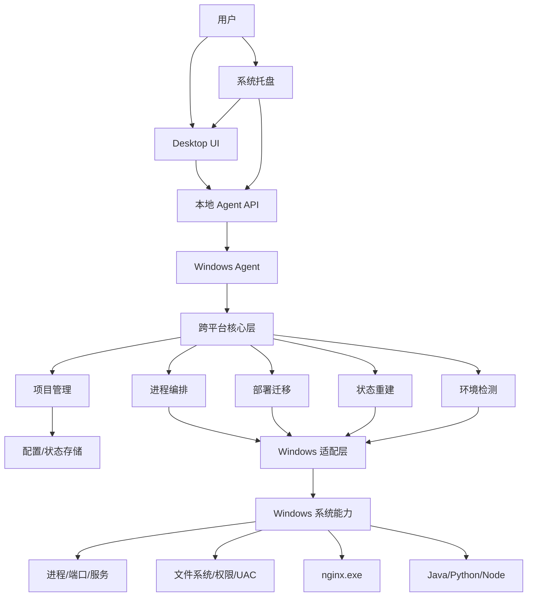
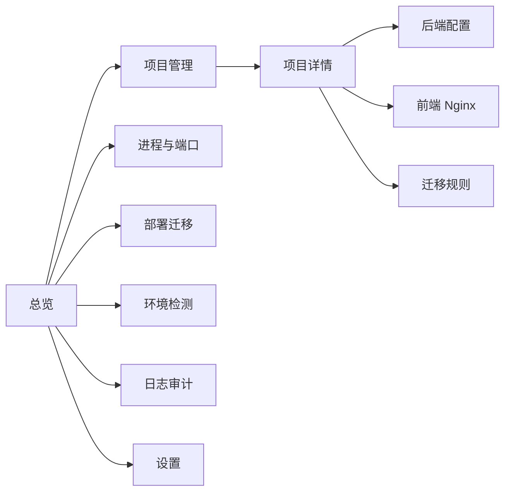
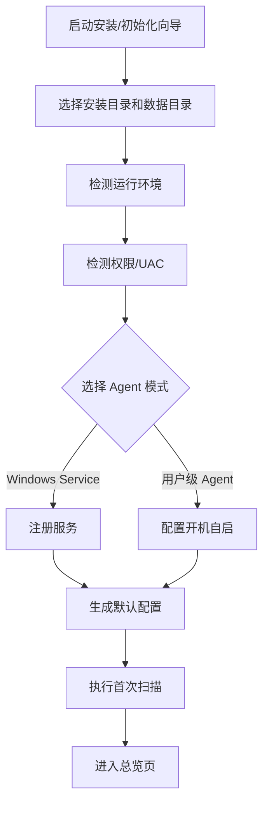
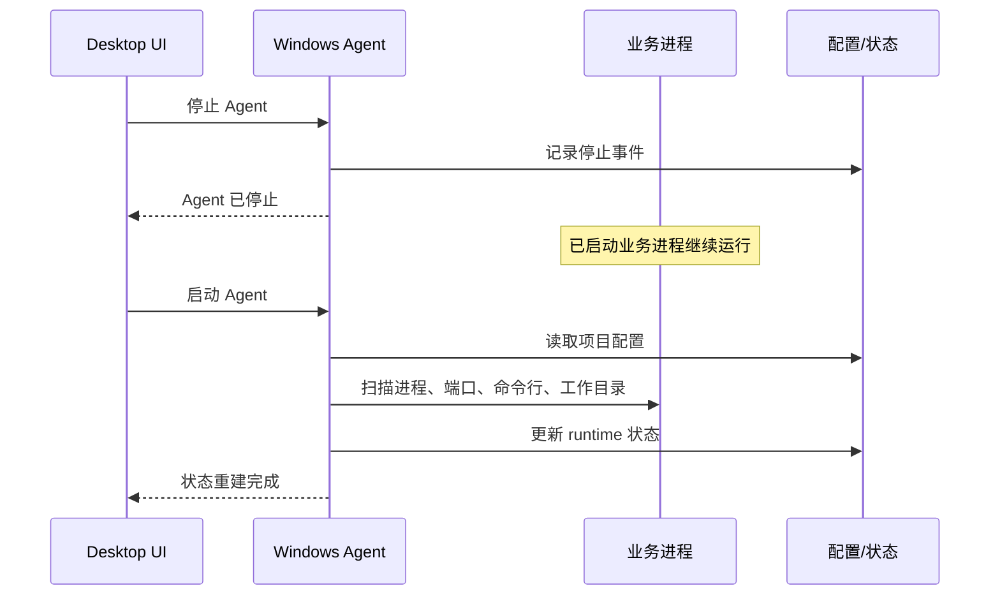
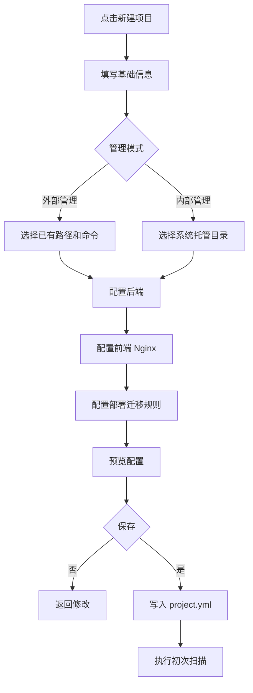
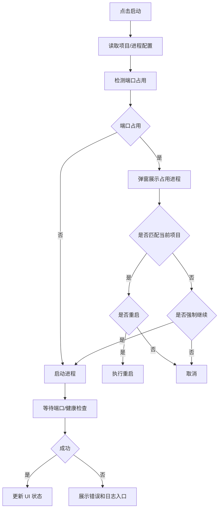
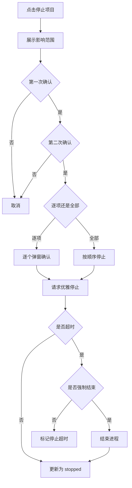
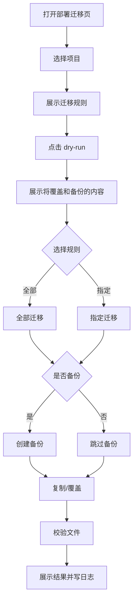
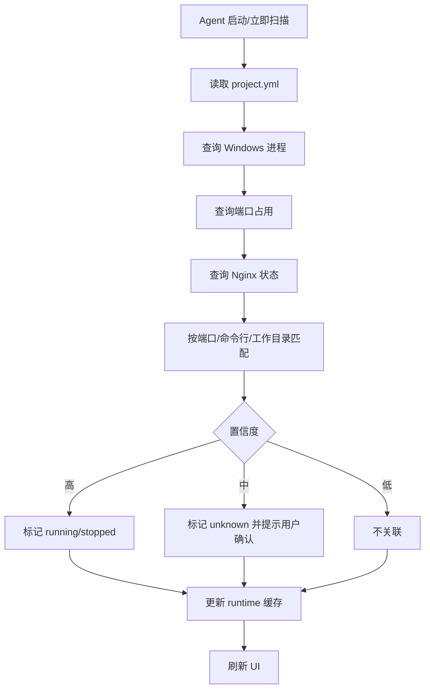

# 服务管理系统产品文档（Windows 版）

## 1. 产品定位

Windows 版与 Linux 版共享同一套核心项目模型、进程模型和部署迁移规则，但提供图形化管理界面。它面向需要在 Windows 服务器或开发机上管理 Java、Python、Node、Nginx 等服务进程的场景。

Windows 版的核心原则仍然是：轻量、清晰、可恢复、进程与管理服务解耦。图形界面只负责管理体验，不改变底层行为。

## 2. 产品目标

1. 功能与 Linux 版保持一致：初始化、项目管理、进程启停、Nginx 管理、文件迁移、状态重建、端口查看。
2. 增加桌面 GUI：用页面、表格、按钮、弹窗和状态图替代大部分命令行交互。
3. 支持托盘运行：关闭主窗口不等于停止管理服务。
4. 支持 Windows Service 或用户级 Agent 两种运行方式。
5. 管理服务停止不影响已启动的业务进程。
6. 重启管理服务后，通过配置、进程、端口、命令行、工作目录重新恢复状态。

## 3. 运行形态

| 组件 | 说明 |
| --- | --- |
| Desktop UI | 桌面管理界面，负责项目配置、进程操作、部署迁移和状态查看。 |
| Tray | 系统托盘入口，支持打开主界面、查看状态、启动/停止 Agent。 |
| Agent | 后台管理服务，负责实际进程管理、环境扫描、状态缓存和日志。 |
| Core | 跨平台核心逻辑，可与 Linux 版复用项目模型和编排逻辑。 |
| Adapter | Windows 系统适配层，封装 PowerShell、CIM/WMI、端口、进程和文件操作。 |

建议运行方式：

1. 服务器场景：Agent 安装为 Windows Service。
2. 个人开发机场景：Agent 以用户级后台进程启动。
3. GUI 通过本地命名管道或 `127.0.0.1` 本地端口访问 Agent，不默认开放远程访问。

## 4. 总体架构



## 5. UI 信息架构



主界面页面：

| 页面 | 功能 |
| --- | --- |
| 总览 | 展示 Agent 状态、项目运行概览、端口冲突、最近操作。 |
| 项目管理 | 创建、编辑、查询项目，执行 `st`、`sp`、`rst` 等快捷操作。 |
| 项目详情 | 查看项目配置、后端、前端、部署规则、运行状态。 |
| 进程与端口 | 查看 Java、Python、Node、Nginx 等进程和端口占用。 |
| 部署迁移 | 执行 dry-run、备份、全部迁移或指定迁移。 |
| 环境检测 | 查看 Java、Python、Node、Nginx、PowerShell、权限状态。 |
| 日志审计 | 查看系统日志、操作日志、项目日志。 |
| 设置 | 配置扫描频率、默认备份策略、Agent 启动方式、日志保留策略。 |

## 6. Windows 推荐目录结构

全局数据目录：

```text
C:\ProgramData\ServiceManagementSystem\
  conf\
    app.yml
    logging.yml
  data\
    projects\
    runtime\
    backups\
    logs\
  templates\
  tmp\
```

用户级界面数据：

```text
%LOCALAPPDATA%\ServiceManagementSystem\
  ui\
    window-state.json
    recent-projects.json
  logs\
    ui.log
```

单个项目目录：

```text
C:\ProgramData\ServiceManagementSystem\data\projects\<project_code>\
  project.yml
  deploy-files\
    backend\
    frontend\
    config\
  backups\
    files\
    dirs\
  logs\
  scripts\
  runtime.json
```

## 7. 数据模型

Windows 版沿用 Linux 版 `project.yml`，但路径使用 Windows 格式，启动命令支持 `cmd`、PowerShell、可执行文件和脚本。

```yaml
code: demo
name: 示例项目
manageMode: external

backends:
  - name: api
    runtime: java
    workDir: D:\apps\demo\backend
    startCommand: "java -jar demo-api.jar --server.port=8080"
    stopMode: graceful
    expectedPorts: [8080]
    healthCheck: "http://127.0.0.1:8080/actuator/health"
    match:
      commandContains: "demo-api.jar"
      cwd: D:\apps\demo\backend

frontends:
  - name: web
    nginxMode: dedicated
    rootDir: D:\apps\demo\frontend\dist
    nginxExe: D:\tools\nginx\nginx.exe
    nginxConf: D:\tools\nginx\conf\nginx.conf
    expectedPorts: [80]
    reloadCommand: "D:\tools\nginx\nginx.exe -s reload"
    stopCommand: "D:\tools\nginx\nginx.exe -s quit"

deployRules:
  - name: api-jar
    source: deploy-files\backend\demo-api.jar
    target: D:\apps\demo\backend\demo-api.jar
    type: file
    backup: true
```

## 8. 初始化流程

Windows 版初始化可以通过安装向导或命令行触发。

初始化动作：

1. 创建 `C:\ProgramData\ServiceManagementSystem` 数据目录。
2. 检测 Java、Python、Node、Nginx、PowerShell、tar、7-Zip 等工具。
3. 检测当前权限，判断是否能安装 Windows Service、读取进程命令行、访问目标部署目录。
4. 选择 Agent 运行模式：
   - Windows Service。
   - 用户级后台进程。
5. 生成默认配置。
6. 打开 GUI 总览页展示初始化报告。



## 9. Agent 生命周期

| 操作 | GUI 入口 | 行为 |
| --- | --- | --- |
| 启动 Agent | 托盘/设置/安装后自动启动 | 启动后台管理服务，不自动启动项目。 |
| 停止 Agent | 托盘/设置 | 只停止管理服务，不停止业务进程。 |
| 重启 Agent | 设置/故障提示 | 重启后执行状态重建。 |
| 退出界面 | 关闭窗口 | 默认最小化到托盘，不停止 Agent。 |
| 退出应用 | 托盘退出 | 关闭 UI 和托盘；是否停止 Agent 由用户选择。 |



## 10. 项目管理界面

### 10.1 项目列表

项目列表字段：

| 字段 | 说明 |
| --- | --- |
| 状态 | running、partial、stopped、unknown。 |
| 项目代码 | 唯一标识。 |
| 项目名称 | 展示名称。 |
| 管理模式 | 外部管理或内部管理。 |
| 后端 | 后端数量和运行数量。 |
| 前端 | 前端数量和运行数量。 |
| 端口 | 已识别端口。 |
| 操作 | 启动、停止、重启、详情、编辑。 |

### 10.2 创建项目向导

向导步骤：

1. 基础信息：项目代码、项目名称、描述。
2. 管理模式：外部管理或内部管理。
3. 后端配置：数量、名称、运行环境、工作目录、启动命令、端口、匹配规则。
4. 前端配置：Nginx 数量、模式、根目录、配置文件、端口、reload/stop 命令。
5. 部署迁移规则：源文件、目标路径、文件或目录、是否默认备份。
6. 配置预览：展示将保存的配置。
7. 初次扫描：展示可识别的进程和端口。



### 10.3 编辑项目

编辑页分为标签页：

1. 基础信息。
2. 后端。
3. 前端。
4. 部署规则。
5. 匹配与健康检查。
6. 操作日志。

所有修改保存前展示差异摘要。涉及路径覆盖、删除进程配置、修改停止命令等高风险动作时需要确认。

## 11. 快捷操作映射

Windows GUI 与 Linux 命令保持同一语义。

| Linux 命令 | Windows GUI 操作 |
| --- | --- |
| `p -c` | 项目管理页点击“新建项目”。 |
| `p -e <项目>` | 项目详情页点击“编辑”。 |
| `p -l` | 进入“项目管理”页面。 |
| `p -s <项目>` | 打开指定项目详情。 |
| `st <项目>` | 项目列表点击“启动”。 |
| `sp <项目>` | 项目列表点击“停止”。 |
| `rst <项目>` | 项目列表点击“重启”。 |
| `st <项目>-front` | 项目详情前端页点击“启动全部”。 |
| `sp <项目>-backend` | 项目详情后端页点击“停止全部”。 |
| `st <项目>-<进程>` | 进程行点击“启动”。 |
| `sp <项目>-<进程>` | 进程行点击“停止”。 |
| `rst <项目>-<进程>` | 进程行点击“重启”。 |
| `pr -l` | 进入“进程与端口”页面。 |
| `pr -p <端口>` | 在“进程与端口”页面按端口筛选。 |
| `pr -s` | 点击“立即扫描”。 |
| `deploy run <项目>` | 进入“部署迁移”页面点击“执行迁移”。 |

## 12. 进程与端口管理

Windows 适配层应通过以下信息识别进程：

1. PID。
2. 进程名。
3. 命令行。
4. 工作目录。
5. 监听端口。
6. 父进程。
7. 启动用户。

可使用的系统能力：

1. PowerShell `Get-Process`。
2. PowerShell `Get-NetTCPConnection`。
3. CIM/WMI 查询进程命令行。
4. `netstat -ano` 作为兼容回退。
5. Windows Service Control Manager，用于 Agent 自身或用户配置的服务型进程。

### 12.1 启动流程



### 12.2 停止流程

项目级停止必须二次确认：

1. 第一次弹窗展示将停止的后端、前端、端口和影响范围。
2. 第二次弹窗要求用户确认“逐项停止”或“全部停止”。
3. 逐项停止时，每个进程单独确认。
4. 优雅停止超时后，再询问是否强制结束进程。



## 13. 前端 Nginx 管理

Windows 版 Nginx 支持：

1. dedicated 模式：项目独占 `nginx.exe` 实例。
2. shared 模式：多个项目共享一个 Nginx 目录和配置。

界面能力：

1. 检测 `nginx.exe` 路径。
2. 检测 `nginx.conf`。
3. 执行配置测试。
4. reload。
5. quit。
6. 展示 Nginx master/worker 进程和监听端口。

shared 模式默认不直接关闭全局 Nginx，停止时只禁用站点或提示风险。

## 14. 部署迁移界面

部署迁移页包含：

1. 迁移规则列表。
2. 源路径和目标路径。
3. 文件或目录类型。
4. 目标是否存在。
5. 是否默认备份。
6. 最近一次备份。
7. dry-run 按钮。
8. 执行迁移按钮。

### 14.1 备份规则

文件备份：

```text
D:\apps\demo\backend\demo-api.jar
=> D:\apps\demo\backend\demo-api.jar-20260710-103000
```

目录备份：

```text
D:\apps\demo\frontend\dist
=> C:\ProgramData\ServiceManagementSystem\data\projects\demo\backups\dirs\dist-20260710-103000.zip
```

### 14.2 执行流程



## 15. 状态重建

Windows 版状态重建与 Linux 版保持一致，只替换系统探测方式。

重建触发：

1. Agent 启动。
2. Agent 重启。
3. 用户点击“立即扫描”。
4. 打开项目详情时运行态过期。
5. 定时低频扫描。



## 16. 权限与安全

1. Agent 默认只监听本机。
2. GUI 与 Agent 通信需要本地令牌或命名管道权限校验。
3. 安装 Windows Service、写入 `ProgramData`、访问受保护目录、结束其他用户进程时可能触发 UAC。
4. 高风险操作必须弹窗确认。
5. 操作日志不可被 UI 静默删除。
6. 删除项目默认只删除管理配置，不删除外部项目文件。
7. shared Nginx 默认不允许一键关闭全局实例，除非用户明确确认风险。

## 17. 日志

| 日志 | 路径 | 内容 |
| --- | --- | --- |
| Agent 日志 | `C:\ProgramData\ServiceManagementSystem\data\logs\agent.log` | Agent 启停、扫描、异常。 |
| 操作日志 | `C:\ProgramData\ServiceManagementSystem\data\logs\audit.log` | GUI 操作、确认、迁移、进程操作。 |
| UI 日志 | `%LOCALAPPDATA%\ServiceManagementSystem\logs\ui.log` | 界面异常、渲染错误、本地 API 错误。 |
| 项目日志 | `C:\ProgramData\ServiceManagementSystem\data\projects\<project>\logs\project.log` | 项目操作记录。 |

## 18. UI 状态与提示规范

| 状态 | 展示方式 | 用户动作 |
| --- | --- | --- |
| running | 绿色状态点，显示 PID 和端口。 | 可停止、重启、查看日志。 |
| stopped | 灰色状态点。 | 可启动。 |
| partial | 黄色状态点，显示未运行项。 | 可启动缺失项、重启全部。 |
| failed | 红色状态点，显示失败原因。 | 可查看日志、重试。 |
| unknown | 蓝灰状态点，显示“需确认”。 | 可立即扫描或手动关联。 |

错误提示必须包含：

1. 发生了什么。
2. 受影响项目或进程。
3. 系统检测到的原因。
4. 用户下一步可执行动作。

## 19. MVP 范围

第一阶段必须完成：

1. Windows 安装/初始化向导。
2. Agent 启动、停止、重启、状态查看。
3. 托盘入口。
4. 项目创建、编辑、查询。
5. 后端进程启动、停止、重启。
6. Nginx 前端管理。
7. 项目级启动、停止、重启。
8. 进程与端口查看。
9. 部署迁移和备份。
10. Agent 重启后的状态重建。
11. 日志审计页。

第二阶段可扩展：

1. 多窗口日志查看。
2. 项目模板市场。
3. 本机浏览器打开健康检查。
4. 简单的本地通知。
5. 与 Linux 版配置互导。

## 20. 验收标准

1. 安装或初始化后能生成 `ProgramData` 数据目录和默认配置。
2. UI 能展示 Java、Python、Node、Nginx 环境检测结果。
3. Agent 停止后，已启动的业务进程仍然运行。
4. Agent 重启后，UI 能重新识别运行中的项目、PID 和端口。
5. 创建项目向导能配置外部管理和内部管理项目。
6. 项目列表能一键启动、停止、重启项目。
7. 项目停止必须二次确认，并支持逐项停止或全部停止。
8. 端口冲突时，UI 能展示占用进程并要求用户选择。
9. 部署迁移支持 dry-run、是否备份、全部迁移和指定迁移。
10. 文件和目录覆盖前能按日期生成备份。
11. Nginx shared 模式不会默认关闭全局 Nginx。
12. 所有高风险操作都写入操作日志。
